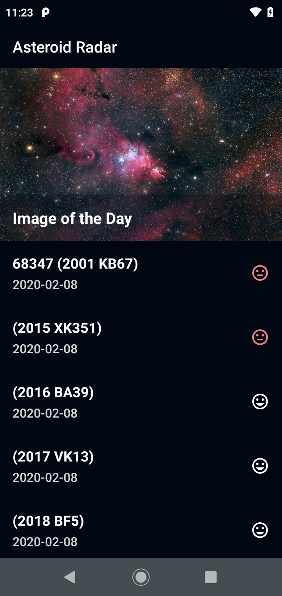
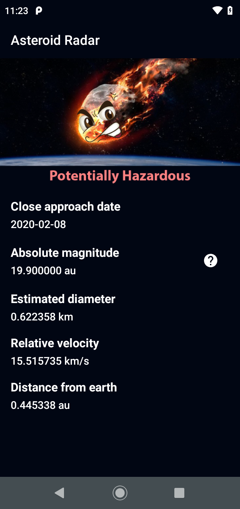
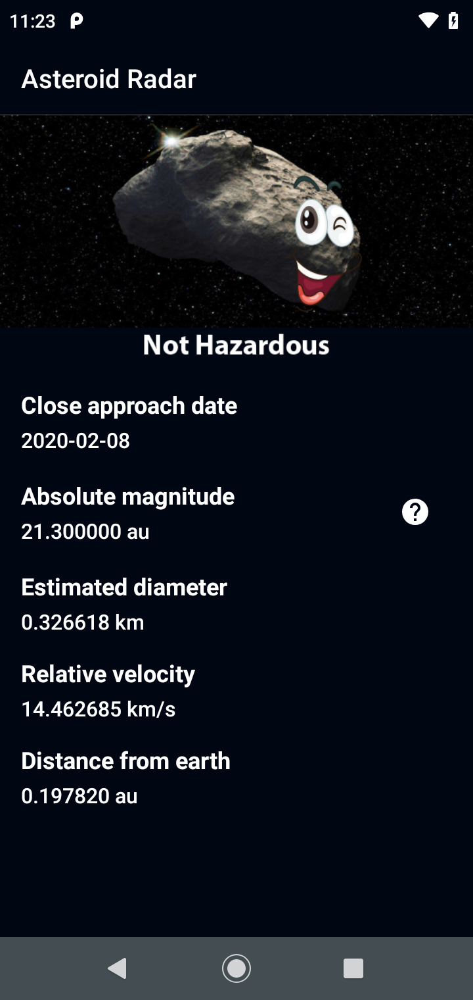
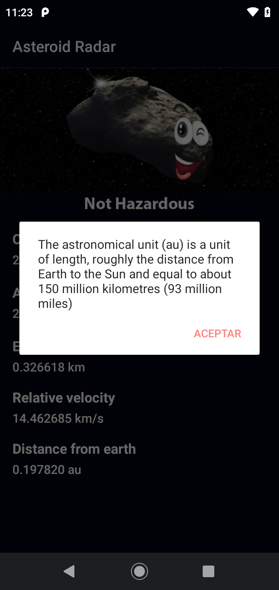
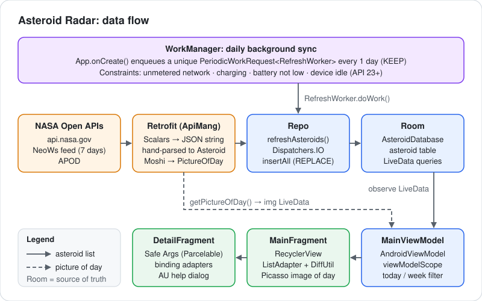

# Asteroid Radar

An Android app that lists the near-Earth asteroids approaching over the next 7 days, using NASA's NeoWs API. It caches them in Room so the list works offline, and WorkManager refreshes them once a day in the background.


| Asteroid list | Hazardous detail | Safe detail | AU help dialog |
|---|---|---|---|
|  |  |  |  |

<sub>These are the reference screens from the Udacity project specification, which came with the starter project. This app follows that design.</sub>

## Features

- **7-day asteroid feed**: pulls near-Earth objects from the NASA NeoWs `feed` endpoint. Each row shows the codename, the close-approach date and a hazard icon.
- **Astronomy Picture of the Day**: the list header loads the APOD image with Picasso and uses the APOD title as its content description.
- **Offline cache**: Room is the single source of truth. The UI observes the `asteroid` table as `LiveData`, and a refresh upserts rows (`OnConflictStrategy.REPLACE`).
- **Daily background refresh**: `WorkManager` runs a unique `PeriodicWorkRequest` once a day, only when the device is on an unmetered network, charging, not low on battery and (on API 23+) idle.
- **Detail screen**: navigation Safe Args passes a `@Parcelize` `Asteroid` to the detail screen. It shows hazard artwork, absolute magnitude, estimated diameter, relative velocity and distance from Earth, and a help button explains astronomical units.
- **Filter**: the overflow menu shows either today's asteroids or the full cached week (the "saved" item currently shows the same cached list).
- **Accessibility**: status icons, the picture of the day and the help button all have content descriptions.

## Tech stack

| Area | Library / API |
|---|---|
| Language | Kotlin, Coroutines (`viewModelScope`, `Dispatchers.IO`) |
| Networking | Retrofit 2 with the Scalars converter (NeoWs JSON, parsed by hand) and the Moshi converter (APOD) |
| Persistence | Room (`AsteroidDatabase`, `RoomDao`) |
| Background work | WorkManager (`CoroutineWorker`, `PeriodicWorkRequest`) |
| Architecture | MVVM: `AndroidViewModel`, `LiveData`, `Transformations.map`, repository |
| UI | Navigation component + Safe Args, Data Binding with `@BindingAdapter`s, RecyclerView `ListAdapter` + `DiffUtil` |
| Images | Picasso |

## Architecture



`Repo.refreshAsteroids()` fetches the NeoWs feed as a raw JSON string, parses it into `Asteroid` objects (`parseAsteroidsJsonResult`), and writes them to Room on `Dispatchers.IO`. `MainViewModel` exposes Room's `LiveData` to `MainFragment`, which feeds a `ListAdapter`, so the list always renders from the local database, including offline. The picture of the day skips the database: the ViewModel calls APOD directly and Picasso loads the URL. `RefreshWorker` reuses the same repository method, so the daily background sync and the refresh on app start follow the same path.

## Getting started

1. Clone the repo:
   ```bash
   git clone https://github.com/darsh-7/Asteroid.git
   ```
2. Open it in Android Studio and let Gradle sync. The project targets an older toolchain (Android Gradle Plugin 4.0.1, Kotlin 1.3.72, `jcenter()`), and the Gradle wrapper JAR/properties are not committed. Android Studio will offer to set up the wrapper and upgrade the plugin.
3. **Add your NASA API key.** Get a free key at [api.nasa.gov](https://api.nasa.gov). `DEMO_KEY` also works for light testing. The key is read in two places:
   - `app/src/main/java/com/udacity/asteroidradar/Constants.kt`: `API_KEY`, used for the picture of the day.
   - `app/src/main/java/com/udacity/asteroidradar/api/ApiMang.kt`: the `api_key=` query parameter in the `@GET` URL of `getAsteroids()`, used for the asteroid feed.

   Replace the value in both places. In your own fork, it's better to move the key into `local.properties` and read it through `BuildConfig` so it isn't committed.
4. Run the `app` configuration on a device or emulator (API 21+).

## About

Built as part of Udacity's Android Kotlin Developer Nanodegree (Asteroid Radar project, 2022).

## Author

**Mostafa Ahmed**: [GitHub @darsh-7](https://github.com/darsh-7) · [LinkedIn](https://www.linkedin.com/in/darsh7/)
